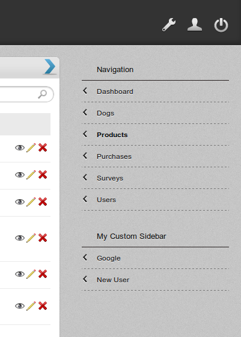

.. _customize_label:

========================
Customization
========================

How to add additional links to sidebar?
---------------------------------------------
In your models (for example, db.py), set :

#. **plugins.instant_admin.extra_sidebar_title** to the title of your sidebar.

#. **plugins.instant_admin.extra_sidebar** to a list of A objects.

For example, if you put this in db.py ::

    plugins.instant_admin.extra_sidebar_title = "My Custom Sidebar"
    plugins.instant_admin.extra_sidebar = [
        A('Google', _href='http://google.com'),
        A('New User', _href=URL('new', args='users')),
    ]

you will get :

How to change the number of items displayed in list view?
----------------------------------------------------------
In your models (for example, db.py), set  **plugins.instant_admin.items_per_page** to a number of your choice. The default is 20.

How to remove the ugly plugin_instant_admin from urls?
-------------------------------------------------------------
You need to use routes.py file for this. Here I show you how to rename 'plugin_instant_admin' to 'admin' in urls.

#. If you don't have routes.py in root directory of web2py installation, create it and add these lines. ::

    routes_in = (
        ('/$app/admin/$anything', '/$app/plugin_instant_admin/$anything'),
    )

    routes_out = [(x, y) for (y, x) in routes_in]

#. If you already have routes.py :

    #. add this line to routes_in tuple. ::

        ('/$app/admin/$anything', '/$app/plugin_instant_admin/$anything')

    #. add this line to routes_out tuple. ::

        ('/$app/plugin_instant_admin/$anything', '/$app/admin/$anything')
