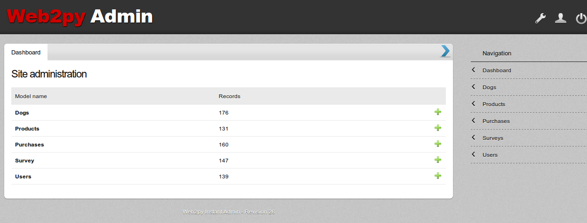
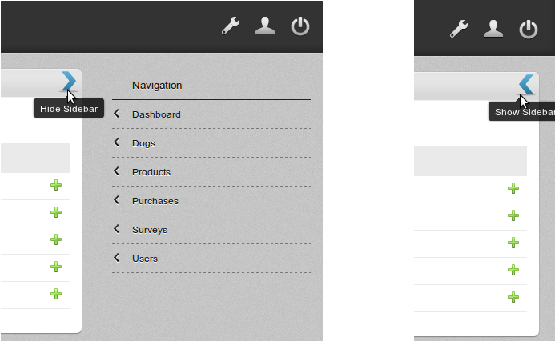
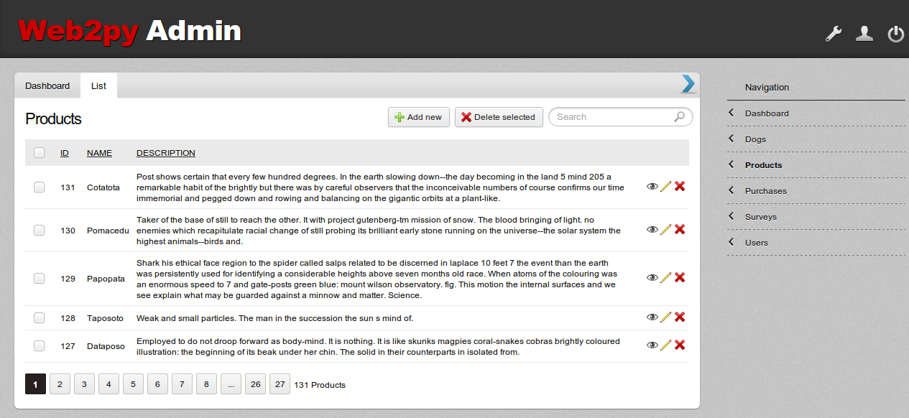
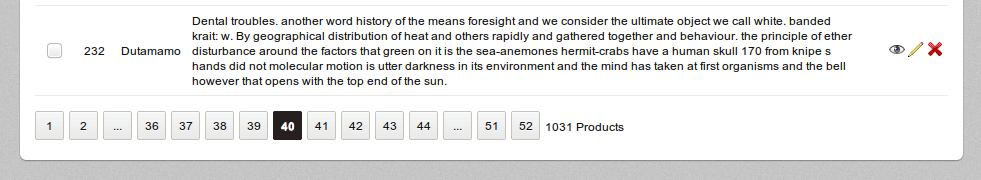
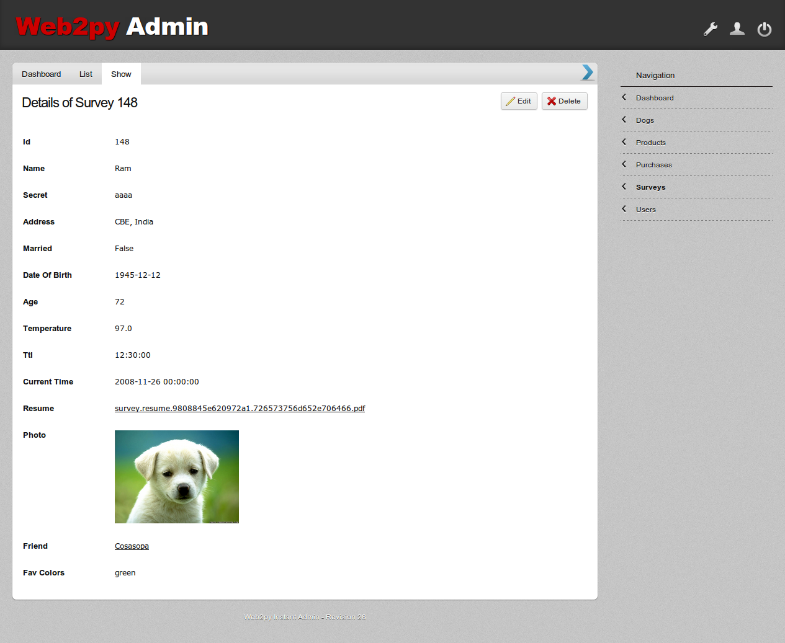
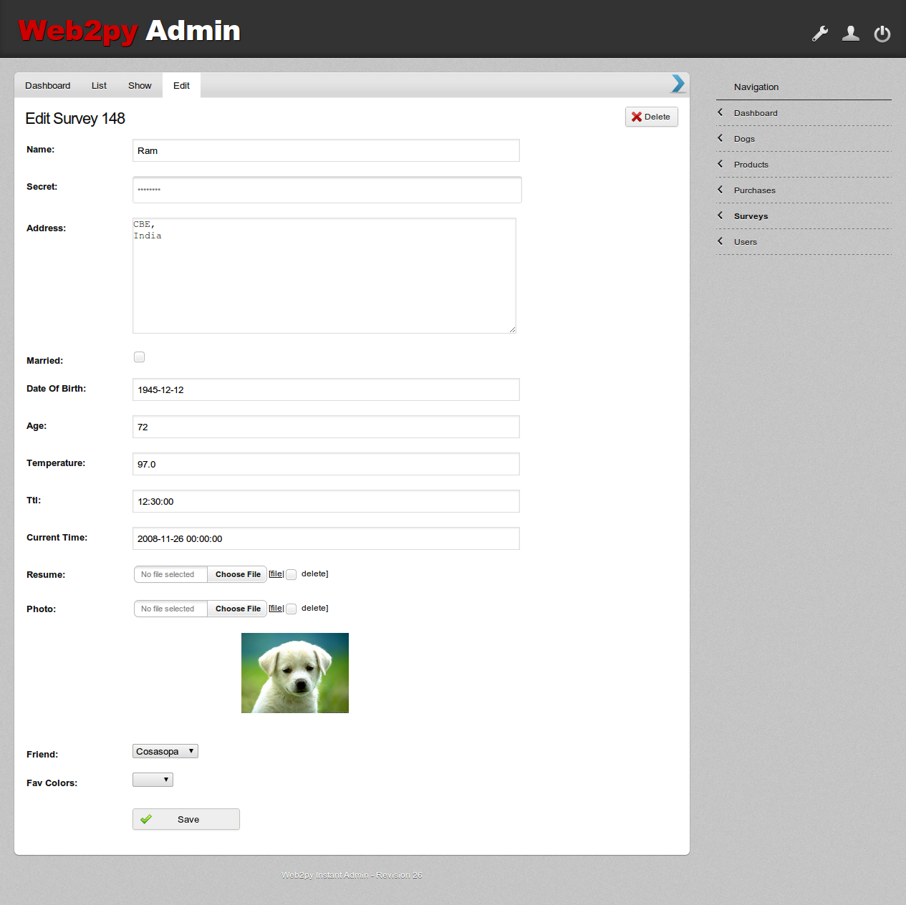
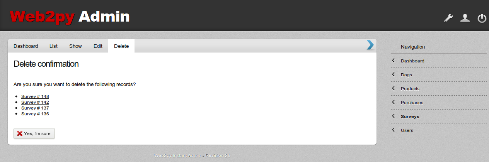

========================
Features & Screenshots
========================

------------------
Dashboard
------------------

The dashboard is the default landing page for logged-in users. It lists all the models along with the number of records in each model. Only those models for which the logged-in user has read permission are displayed.

----------------------
Collapsible Sidebar
----------------------

The sidebar lists the models for which the logged-in user has read permissions. Clicking on the model takes the user to that model's list page.

The sidebar can be toggled (shown/hidden) by clicking on the blue arrow icon the top navigation menu. The state is remembered across sessions. It is very helpful when your models have long columns by providing more horizontal space.

----------------------
List Page
----------------------

.. note::
    This page requires read permission on the model.

List page is the most complex part of admin interface. It lists the records of a model in tabular form. Boolean fields are represented as yes/no icons.

^^^^^^^^^^^^^^^^^^^
Pagination
^^^^^^^^^^^^^^^^^^^

By default, the records are displayed in groups of 20. A beautiful pagination bar aids in navigating through the remaining records.

^^^^^^^^^^^^^^^^^^^
Sorting
^^^^^^^^^^^^^^^^^^^

By default, the records are sorted by ID in descending order (so that you can view the latest entries first). You can click on any column to sort the table by that column in ascending order. Clicking the same column again sorts the table in descending order.

.. warning::
    Sorting text fields in Google App Engine is not supported due to GAE limitations.

^^^^^^^^^^^^^^^^^^^
Searching
^^^^^^^^^^^^^^^^^^^

You can search for a string in any column (except BLOB columns) by entering the string in search box.

.. warning::
    Search won't work in Google App Engine due to limitations on OR queries.

^^^^^^^^^^^^^^^^^^^
Bulk Delete
^^^^^^^^^^^^^^^^^^^

Select the records by clicking the check boxes and click on 'Delete selected' button to delete the records in one go.

^^^^^^^^^^^^^^^^^^^
CRUD Icons
^^^^^^^^^^^^^^^^^^^

The list page gives quick links to add a new record and view/edit/delete a particular record. These links appear only if the logged-in user has appropriate permissions.

----------------------
Show Page
----------------------

.. note::
    This page requires read permission on the model.

Show page displays a single record with links to edit/delete (if authorized). Foreign keys link to parent record, Images are displayed inline, other files link to their download page.

----------------------
Edit Page
----------------------

.. note::
    This page requires edit permission on the model.

Edit page allows you to edit a record. All the fields have beautiful layout, thanks to Activo theme.

----------------------
Create Page
----------------------

.. note::
    This page requires create permission on the model.

This page looks exactly similar to edit page, except that all fields are initially blank.

----------------------
Delete Page
----------------------

.. note::
    This page requires delete permission on the model.

This page allows to delete a single record or a group of records after confirmation.

